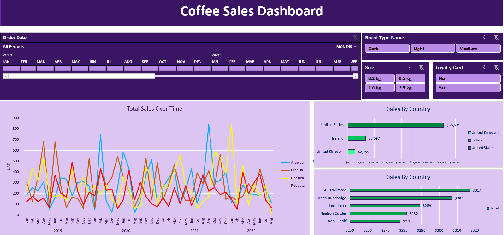

# Coffee Sales Dashboard

The **Coffee Sales Dashboard** is an interactive and visually appealing dashboard created using **Microsoft Excel**. This project was designed as a **practice project** to enhance skills in data analysis and visualization with Excel. 

It provides insights into coffee sales data, helping to analyze trends, performance, and key metrics in an intuitive format. This project demonstrates the potential of Excel in creating functional and professional dashboards. 

